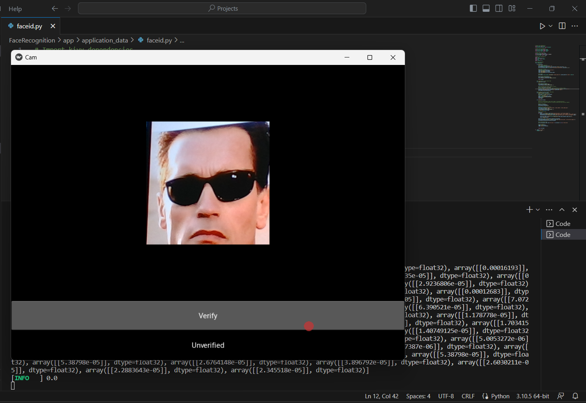

# Face Recognition App
This project implements a face recognition system using Siamese Neural Networks and One-Shot Learning.   The model is built using TensorFlow and the application is deployed using the Kivy framework.

The goal is to recognize and verify faces from images or videos, even with limited training data.
# Introduction
Face recognition is vital in computer vision for various applications. Siamese Neural Networks and One-Shot Learning address the challenge of limited labeled training data for each individual. 

Siamese networks measure similarity or dissimilarity between input samples. One-shot learning recognizes new classes with just one example per class.

 One-shot learning overcomes the need for a large number of samples per person, making it feasible to recognize individuals without prior extensive training.

By leveraging Siamese Neural Networks and One-Shot Learning, face recognition becomes more practical and efficient in scenarios where collecting extensive labeled data is challenging or time-consuming. 
It opens up possibilities for surveillance systems, access control, and personalized user experiences, even with limited training resources.

# Dataset
The face recognition model requires a labeled dataset for training. The dataset should contain images of people's faces, with each person's images grouped together. 

# Architecture
The face recognition model is built using a Siamese Neural Network architecture. The Siamese network consists of two identical subnetworks  which share the same weights and architecture.

Siamese networks are trained on face image pairs to extract discriminative feature embeddings. These embeddings encode essential characteristics of each face.  
 During inference, the model compares test face embeddings with known face embeddings for identification and verification.

The model architecture consists of multiple convolutional and pooling layers, followed by a final embedding block with dense layers.

# Results

*Example 1:*
A photo of me is verified by the Face Recognition App

*Example 2:*
A photo of Arnold Schwarzenegger is not verified by the Face Recognition App

